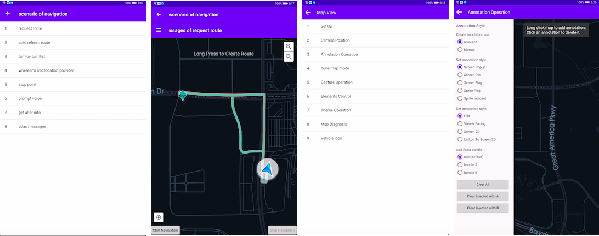

## Telenav Android SDK Demo App
This is a demo of tasdk for Android.The demo contains a set of scenarios to help you learn how to use tasdk in Android.
Each scenario demonstrates different use cases and APIs.

## Prerequisites
- Android Studio
- Gradle

## Getting Started
The demo use the Gradle build system. Use the "gradlew build" command or use "Import Project" in Android Stuido.

## Running locally
Set parameters in gradle.properties
```kotlin
// please obtatin API key and secret from Telenav and set them here. (double quotes is needed here)
API_KEY="Your API key"
API_SECRET="Your API secret"
```

Screenshots
-----------

