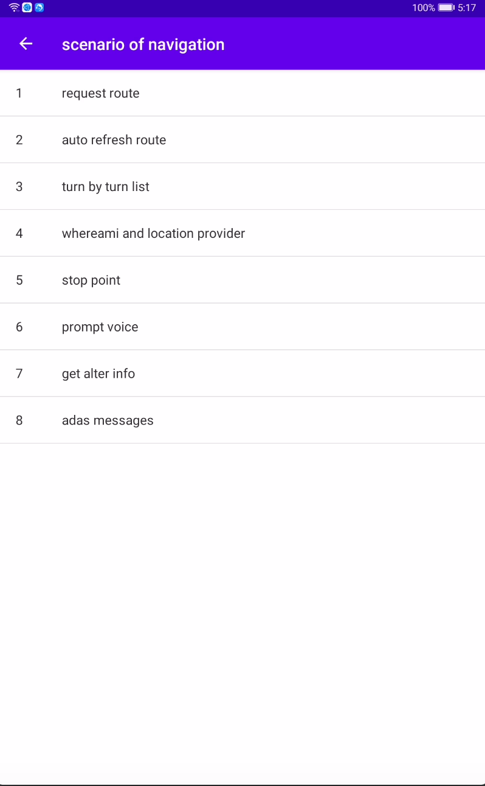
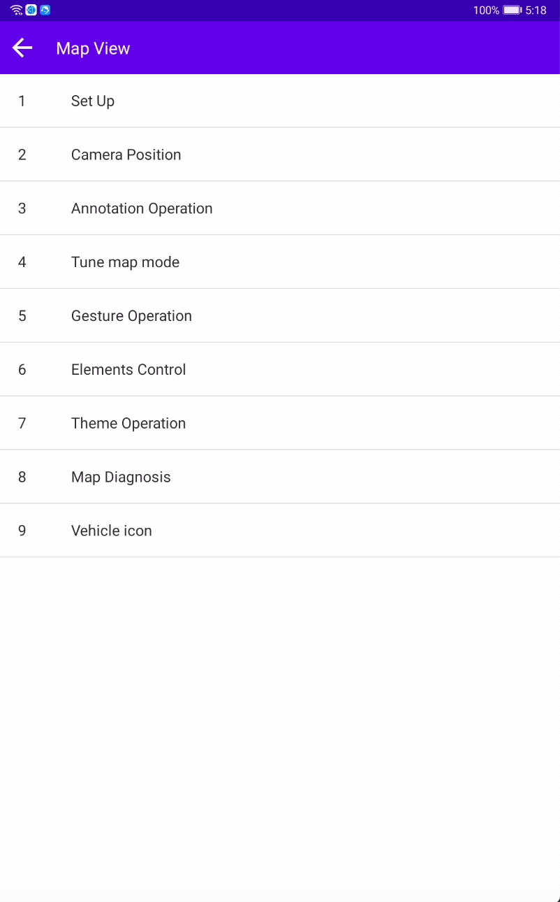
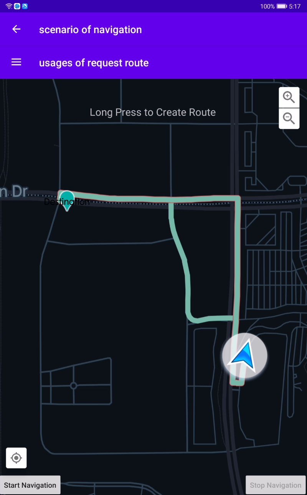
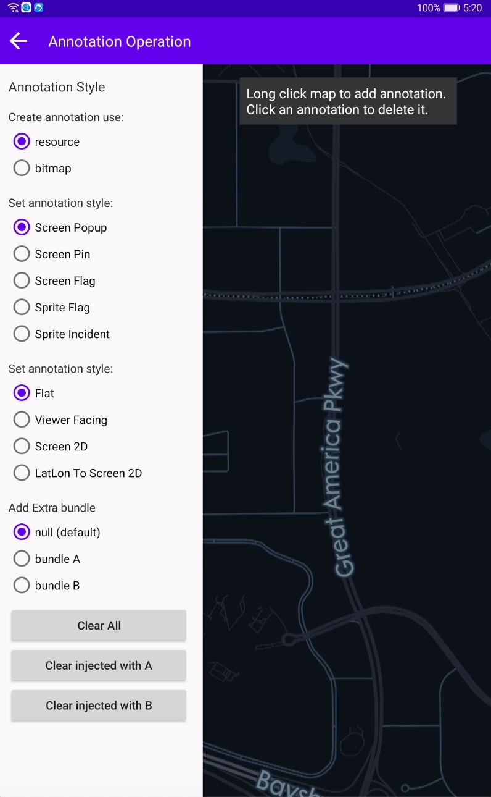

## Telenav Android SDK Demo App
This is a demo of tasdk for Android.The demo contains a set of scenarios to help you learn how to use tasdk in Android.
Each scenario demonstrates different use cases and APIs.

## Prerequisites
- Android Studio
- Gradle

## Getting Started
The demo use the Gradle build system. Use the "gradlew build" command or use "Import Project" in Android Stuido.

## Running locally
Setting App key and secret
```kotlin
const val SDK_KEY = "SDK_APP_KEY"
const val SDK_SECRET = "SDK_APP_SECRET"
```

Screenshots
-----------





